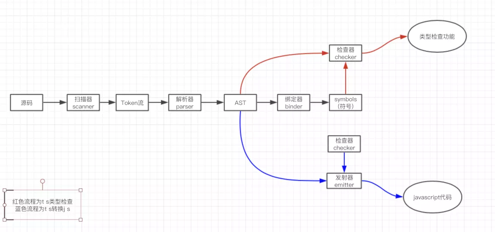

解释型语言到编译型语言，中间多了的编译环节，为了最大限度地将运行时错误扼杀在编译时，增强原有功能的超集

例如炒菜和火锅的例子。在大型的、多人协作的、核心或公用等场景下使用typescript


## TypeScript 编译原理

TypeScript 编译器源文件位于 src/compiler 目录下

它分为以下几个关键部分：

Scanner 扫描器（scanner.ts）
Parser 解析器（parser.ts）
Binder 绑定器（binder.ts）
Checker 检查器（checker.ts）
Emitter 发射器（emitter.ts）

> 语法正确并不意味着语义上也正确 `var foo: number = 'not a number';`,语义 从自然语言角度意味着有意义，理解这个概念对你很有用。




若以常见的AST生成过程类比，可简单类比上述的 扫描器阶段 可对应为 词法分析过程，解析器阶段可对应为语法分析过程。

词法分析 - 语法分析 - 语义分析

绑定器和最后的检查其


- 数据类型
  - Any
    - 在编程阶段还不清楚类型的变量指定一个类型，直接让它们通过编译阶段的检查
    - Object类型的变量只是允许你给它赋任意值，但是却不能够在它上面调用任意的方法
    ```ts
      let notSure: any = 4;
      notSure = "maybe a string instead";
    ```


接口
TypeScript的核心原则之一是对值所具有的结构进行类型检查。
被称做“鸭式辨型法”或“结构性子类型化”。
```ts


```